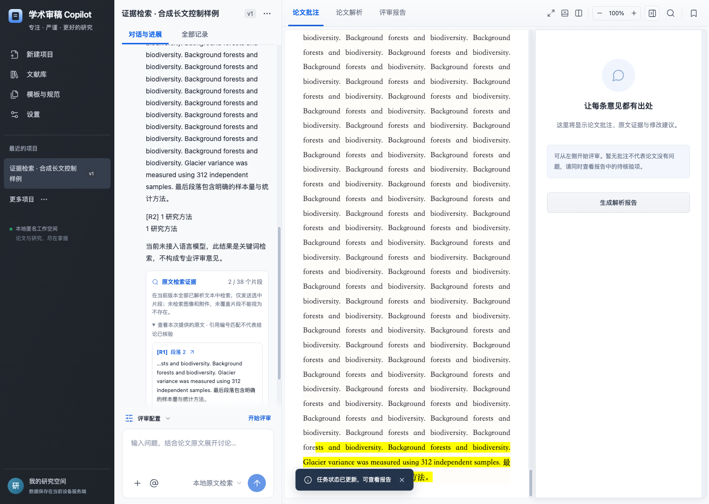

# 学术审稿 Copilot

面向生态学实证论文的 AI Web 工作台。上传 PDF/DOCX，将原文检索、流式问答、证据批注、分项评审、修订复查和报告导出放在同一工作空间。基于 Vue 3、TypeScript、Node.js 与 SQLite，默认运行于本机。



## 第九届传智杯 AI WEB

本作品以浏览器 Web 应用参加 AI WEB 网页开发挑战赛；桌面安装包作为补充形式。核心能力是全文分块检索与证据定位、可复核的评审工作流、PDF 图文分析和版本问题追踪。参见 [评分与提交要求对照](docs/competition.md)、[技术文档](docs/technical-document.md)、[技术文档 PDF](docs/technical-document.pdf)、[6 分钟演示脚本](docs/demo-script.md) 和 [本轮 AI 开发记录](docs/ai-development-log.md)。

仓库维护者：`xzj828`；协作开发者以 GitHub 提交历史为准。参赛队伍学校、成员和指导教师的实名信息由队伍按报名登记补齐，不能从 GitHub 昵称推断。视频须由团队按脚本录制，仓库推送不等于完成赛事系统提交。

## 运行

需要 **Node.js 24.12+**（后端使用 Node 自带 SQLite）。

```sh
npm ci
npm run dev
```

打开 http://127.0.0.1:5173 。开发环境启动 Vue/Vite（5173）和 API（3001），同源代理转发 API；代理保留浏览器原始 Host（`changeOrigin: false`），使后端同源写入校验与浏览器 Origin 一致。

生产运行：

```sh
npm run build
npm start
```

打开 http://127.0.0.1:3001 。后端直接提供构建后的前端与 API，无需另外启动 Vite。

默认仅监听本机。`PORT`、`HOST`、`DATA_DIR` 可通过进程环境变量配置，字段说明见 [.env.example](.env.example)。程序不会自动加载 `.env`；需要时使用 `node --env-file=.env server/index.js`。

### Windows 桌面版

桌面版将现有前后端封装为 Windows x64 安装程序，用户不需要安装 Node.js。运行数据保存在 Electron 的用户数据目录中，不写入安装目录，也不占用作者的云服务器空间：

```sh
npm run desktop:start    # 本机开发启动
npm run desktop:package  # 生成未安装的桌面应用
npm run desktop:make     # 生成 Setup.exe
```

安装、备份、隐私边界、SmartScreen 提示和 GitHub Release 操作见 [桌面版发布说明](docs/desktop-release.md)。

## 已实现

- Vue 3 Composition API、TypeScript、Vite；项目、对话、批注栏拖动调宽并记忆，聊天和预览独立滚动，预览最大化/最小化、上下/左右布局，窄屏适配。
- 项目创建、搜索、重命名、切换、删除；悬浮三点菜单支持置顶、归档与恢复，操作非当前项目不会切换或删除当前项目。
- PDF/DOCX 实际上传（25 MB 上限）；SHA-256 去重，原始文件独立保存。
- 独立 Worker 解析，真实进度、失败重试、超时中止；服务重启后的中断状态恢复。
- PDF 文本与坐标提取，PDF.js 原始页面渲染、缩放、翻页和关键词高亮。
- DOCX 段落文本提取与结构预览；明确提示分页、图片、公式和表格覆盖限制。
- 首次使用为空工作空间；真实评审批注支持上下条导航、片段定位、证据说明、修改建议和问题状态跟踪。
- 批注与聊天、报告联动；未启用模型时使用本地原文检索，启用后使用真实模型 API 生成回答。问答从当前版本全部已解析文本中进行 BM25 分块检索，最多发送 8 个片段、12000 字符上下文；可点击原文来源，显示检索范围并校验引用编号，未找到证据时不调用模型。
- 发送按钮左侧的模型菜单支持切换已保存的模型；点击“配置自定义模型”打开独立弹窗，支持 API Base URL、模型 ID、API Key、连接测试、启用/停用、密钥替换与清除。支持 Chat Completions 兼容服务；密钥按匿名工作空间隔离，服务端 AES-256-GCM 加密保存，GET 不回传密钥。
- 对话通过 SSE 实时逐段输出，Markdown 安全渲染为标题、列表和加粗；中断显示错误，不保存未完成回答。项目删除无需输入项目名。
- 版本化任务、问题账本、独立报告快照、Markdown 导出；历史报告不随问题跟踪状态改变。
- 两个真实版本的文本区块差异；不将原文移除误标为“问题解决”。
- SQLite 持久化，匿名 HttpOnly/SameSite Cookie，项目与文件访问隔离、同源写入校验。
- 浏览器自动化、API/规则测试，以及可启用的 GitHub Actions 工作流模板。

## 文献库、模板与设置

侧栏的文献库、模板与规范、设置已改为完整页面，支持 `#library`、`#templates`、`#settings` 直接访问和刷新。主导航不再显示“我的项目”，最近项目和“更多项目”保留。

文献库支持PDF/DOCX批量导入、真实解析状态、集合、搜索、网格/列表、重要/待读标记和可恢复回收站。点击文献打开可缩放、翻页的预览卡片；演示记录无原始PDF时明确展示节选。回收站仅移出文献库，不删除原项目或历史报告。模板页支持查看、筛选、复制为独立版本、区块排序及归档；历史结果仍引用原始版本。

设置在匿名工作空间内保存到SQLite，浅色、护眼和深色主题点击即时预览，保存后持久化，并应用于管理页和文档预览；缩放、目录和连续阅读会实际生效；默认评审选项用于新项目。可选自动模型匹配只在PDF图表评审时优先选择已启用的图像模型，不自动启用已关闭的模型服务，也不覆盖当前模型选择。数据管理可导出项目、对话、报告和设置JSON；原始文件单独下载，密钥不导出。

视觉对照与接受的内容差异见 [设计验收](design-qa.md)。

## 当前能力边界

这是**可运行、带真实文档处理和持久化的首版工作台**，不是已经通过专家验收的专业审稿系统。

已实现 `stxb-precheck@0.1.0-trial` 试运行评审：E01–E09 九项科学质量检查，加生态学范围与伦理材料两项门槛。每项使用真实模型调用、结构化输出校验、原文逐字引用匹配及独立请求的模型论证复核。程序生成问题账本、暂定建议和可选分项得分；未经专家校准，不作为期刊正式评审。

应用不再内置演示项目。自动测试会在独立测试数据库中显式建立合成控制样例，用来验证交互和数据链路；预置测试意见不能作为真实论文判断或专业准确率依据。

新增 `stxb-precheck@0.2.0-trial`，按固定提交适配 nature-reviewer / nature-statistics 方法，保留源文件、许可、映射和边界样例；在“规则版本”中明确选择后用于新任务。详见 [适配记录](docs/nature-adaptation.md)。原版与历史报告保留。

适配版支持 PDF 页面渲染、模型图表定位与裁剪、图文联合分析及复核、页内区域跳转。需在模型设置勾选图像输入，并使用支持 `image_url` 的兼容模型。最多处理24页、每批渲染12MB、40个图表区域；不可读或不完整时 E09 不计完整分。DOCX 视觉审查须另存为 PDF；未实现 OCR、公式精确恢复或专家视觉核验。

可用 Crossref / DataCite 检索中英文主题，保存查询、时间、来源、访问失败和去重记录。适配版将最新快照用于摘要范围的创新性比较，核对内外部引文并复核；尚未覆盖付费中文数据库、全文方法核验和完整创新性评分，E02 仍为空分。因此不产生完整总分或完整录用/小修结论。

版本比较增加模型语义复审，逐个核对旧问题在新版的证据与解决条件，不自动关闭问题。标准与模板页面可保存自定义规则和模板版本；模板调整标题、说明与区块顺序，不改变判断。报告支持 Markdown、PDF、DOCX 导出。PDF 导出要求服务器安装 Chrome（Windows 可设置 `CHROME_PATH`）或 Playwright Chromium（其他系统运行 `npx playwright install chromium`）。

已建立 [校准工具与标注格式](docs/calibration.md)，但**真实论文模型质量验证和领域专家校准仍未完成**，不能把功能回归通过当作专业准确性验收。详见 [实施说明](docs/implementation.md)。

2026-09-26 已使用 DeepSeek-V4.1-Flash 实测生态学合成控制样例及PDF图表，修复推理预算与图表证据编号适配。详见 [实测记录](docs/deepseek-ecology-experiment.md) 和 [生态学缺口补齐顺序](docs/ecology-gap-plan.md)。目前只支持生态学实证研究，真实模型调用成功不等于专家质量验收。

新增 `stxb-precheck@0.3.0-trial`，新项目默认使用：每个检查项返回独立问题列表，按主张、缺陷及重合证据逐条复核去重；材料请求单列且不计分；问题保存严重性、修复路径和复查条件。同维度权重只计算一次。旧版仍可显式选择，已有报告不重写。详见 [逐条问题修复与验证](docs/atomic-review-verification.md)。

## 使用科学评审

1. 新建项目并上传 PDF/DOCX，等待解析完成。
2. 配置并启用模型；选择“实证研究”、规则版本和输出方式。需要视觉审查时启用模型图像输入；需要外部比较时先在“外部文献与创新性比较”中检索。
3. 点击“开始评审”。后台按项保存进度，可取消；失败、取消或重启中断后可重试未完成项。重试保持原规则和输出设置，变更模型地址或 ID 后需要新建任务。
4. 点击“查看评审报告”，检查逐项论证、待补充材料、得分覆盖率；点击证据定位原文，可按模板保存新快照并导出 Markdown、PDF、DOCX。

每轮发送完整解析文本（上限 60000 字符，超限明确拒绝，不静默截断），文字原版最多20次、视觉及外部比较复核最多23次模型调用；逐条版每项独立复核（包括材料请求），文字最多22次，加图表定位和摘要比较复核最多24次。每次请求最长90秒，按服务商实际计费。最多同时运行3个科学评审任务，每版本最多20次。语义复审独立执行，每个旧问题最多2次请求、每任务最多40个问题。选中的模型必须支持相应上下文和 JSON 输出。更换模型、视觉配置或执行器版本后需发起新评审。对话仍独立于评审，不会自动改写结果。

规则权重来自设计文档候选方案，由程序按 0–4 等级换算。缺失、失败、引用或推理未通过的检查不扣分、不记满分；部分得分显示“已评项得分/已评项满分”与覆盖率。同一缺陷的跨项重复会经复核关联到主项并停止重复计分。二次模型复核不等于人工同行评审，也不能保证模型没有遗漏或误判。

## 配置模型

打开左侧 **设置 → 模型服务 → 管理模型**（输入框下方也有“配置模型”入口），填写服务商提供的 Base URL、模型 ID 和 Key。点击“测试连接”会发送一条短测试消息，可能按服务商标准计费；测试成功后点击“保存模型配置”并勾选启用。

协议采用 `/chat/completions`、Bearer 鉴权和 `choices[0].message.content`，可参考 [DeepSeek 官方接口文档](https://api-docs.deepseek.com/api/create-chat-completion/)。远程服务要求 HTTPS；本机 `localhost` / `127.0.0.1` 可使用 HTTP。未支持原生 Anthropic Messages、Gemini 或 Responses 专用协议。

每次模型问答检索当前版本的全部已解析文本，最多发送 8 个相关片段及 12000 字符检索上下文，另附最近六条对话和选中批注。一般概括问题采用全文均匀抽样，明确标注覆盖边界；问答不能由未命中推断全文缺失。中文采用分词和双字匹配，并支持有限中英科研术语扩展；不使用向量嵌入，不宣称跨语言语义检索。不会默认发送整个文献库或其他项目。密钥不保存在 localStorage，修改 API 地址需要重新提供 Key，避免向新服务发送旧密钥。加密主密钥保存在 `data/.model-encryption-key`，备份与恢复时需要同时保护数据库和该文件；它不防范能够读取整个服务器数据目录的管理员。

匿名空间按浏览器 Cookie 识别，数据保存在**运行服务器的设备**，不是浏览器本地存储。清除 Cookie 后当前浏览器失去该空间访问凭据；首版没有账号恢复与跨设备同步。不要将本机服务直接暴露到公网；多人部署前需要 HTTPS、容量/速率治理、备份和服务级隔离。

## 自检

```sh
npm run build       # Vue/TypeScript 类型检查与生产构建
npm test            # 规则和 HTTP API 集成测试
npm run test:e2e    # 浏览器端到端测试
npm run check       # 依次执行全部检查
```

Windows 默认使用已安装的 Chrome，可通过 `CHROME_PATH` 指定浏览器路径。Linux/macOS 先执行 `npx playwright install chromium`。

GitHub Actions 模板保存在 [docs/github-actions.yml](docs/github-actions.yml)。当前本机 GitHub 令牌没有 `workflow` 权限，因此未启用远端 CI；获得该权限后，将模板放到 `.github/workflows/check.yml` 即可。模板会安装浏览器依赖并执行全部检查。

浏览器测试覆盖桌面、390px 手机、批注、搜索、对话、报告导出、真实 PDF/DOCX 上传、解析、版本对比、刷新恢复和删除。截图保存在 `docs/screenshots/`。测试只使用程序生成的微型 PDF/DOCX，不使用真实研究资料。

API 测试使用独立临时数据库，浏览器测试使用独立端口与测试数据目录。`data/`、`test-results/`、本机环境文件、依赖和构建目录全部在 Git 忽略清单中。

## 代码结构

```text
src/
  App.vue                 工作台与项目交互
  components/             图标、可访问弹窗、PDF 阅读器
  api.ts / types.ts        API 客户端与前端数据契约
  style.css               视觉稿还原与响应式布局
server/
  index.js                HTTP API、匿名隔离、上传和任务生命周期
  store.js                SQLite 持久化
  parser.js               PDF / DOCX 文档解析 Worker
  engine.js               结构报告、原文校验与本地问答
  review-pack.js          版本化试运行规则、权重和评分锚点
  review.js               分项执行、复核、重试、聚合与报告快照
  models.js               模型配置加密和真实 HTTP 调用
  retrieval.js            全文分块、BM25、原文来源和引用编号核对
  project.js              空项目及默认评审设置
tests/                    规则、API 和浏览器测试
docs/                     原始设计、自检记录与截图
```

前端采用 [Vue 官方推荐的 Vite 构建方式](https://vuejs.org/guide/quick-start)，文档解析使用 [PDF.js](https://github.com/mozilla/pdf.js) 与 [Mammoth](https://github.com/mwilliamson/mammoth.js)。依赖的确切版本由 `package-lock.json` 固定。
