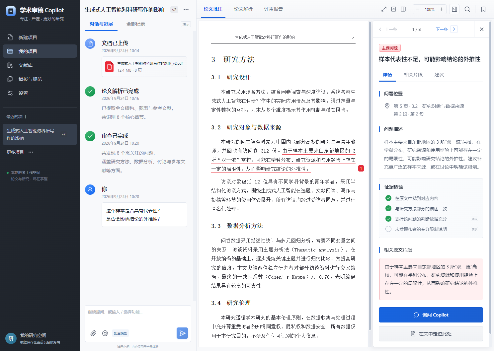

# 学术审稿 Copilot

基于项目目录中的产品设计与视觉稿开发的 Vue 3 论文工作台。深色项目导航、持续对话时间线、论文原文与侧边批注组成 Codex 式三栏布局。



## 运行

需要 **Node.js 24.12+**（后端使用 Node 自带 SQLite）。

```sh
npm ci
npm run dev
```

打开 http://127.0.0.1:5173 。开发环境启动 Vue/Vite（5173）和 API（3001），同源代理转发 API。

生产运行：

```sh
npm run build
npm start
```

打开 http://127.0.0.1:3001 。后端直接提供构建后的前端与 API，无需另外启动 Vite。

默认仅监听本机。`PORT`、`HOST`、`DATA_DIR` 可通过进程环境变量配置，字段说明见 [.env.example](.env.example)。程序不会自动加载 `.env`；需要时使用 `node --env-file=.env server/index.js`。

## 已实现

- Vue 3 Composition API、TypeScript、Vite；项目、对话、批注栏拖动调宽并记忆，聊天和预览独立滚动，预览最大化/最小化、上下/左右布局，窄屏适配。
- 项目创建、搜索、重命名、切换、删除；悬浮三点菜单支持置顶、归档与恢复，操作非当前项目不会切换或删除当前项目。
- PDF/DOCX 实际上传（25 MB 上限）；SHA-256 去重，原始文件独立保存。
- 独立 Worker 解析，真实进度、失败重试、超时中止；服务重启后的中断状态恢复。
- PDF 文本与坐标提取，PDF.js 原始页面渲染、缩放、翻页和关键词高亮。
- DOCX 段落文本提取与结构预览；明确提示分页、图片、公式和表格覆盖限制。
- 内置演示论文及 8 条问题；红线批注、上下条导航、片段定位、证据说明、修改建议、问题状态跟踪。
- 批注与聊天、报告联动；未启用模型时使用本地原文检索，配置并启用后通过真实模型 API 回答，输出标为待核验建议。
- 设置中的模型配置支持 API Base URL、模型 ID、API Key、连接测试、启用/停用、密钥替换与清除。支持 Chat Completions 兼容服务；密钥按匿名工作空间隔离，服务端 AES-256-GCM 加密保存，GET 不回传密钥。
- 版本化任务、问题账本、独立报告快照、Markdown 导出；历史报告不随问题跟踪状态改变。
- 两个真实版本的文本区块差异；不将原文移除误标为“问题解决”。
- SQLite 持久化，匿名 HttpOnly/SameSite Cookie，项目与文件访问隔离、同源写入校验。
- 浏览器自动化、API/规则测试，以及可启用的 GitHub Actions 工作流模板。

## 当前能力边界

这是**可运行、带真实文档处理和持久化的首版工作台**，不是已经通过专家验收的专业审稿系统。

设计文档明确要求“正式规则需确认和验证后发布”。因此《生态学报》预审标准目前注册为 `0.1.0-draft`，后端拒绝启动正式专业评审。真实上传文件可生成**解析报告**，科学性结论保持“暂无法判定”，不伪造分数或录用建议。

演示项目使用手工构造的论文节选与意见，标有“演示”；预设的大修建议不是对真实论文的判断，也没有完成期刊适配。演示时间线、核验标记和统计值仅供界面体验。原始视觉稿中的 298 页被改为演示的 8 页，避免把不存在的完整文件当作真实文件。

专业语义分析、外部文献检索、OCR、正式评判规则/校准集、DOCX 原版式还原、PDF/DOCX 报告导出尚未完成。模型对话已可接入，但不会自动生成正式 ReviewResult 或修改报告。也没有实际复用 `nature-skills` 的代码或材料。后续接入边界见 [实施说明](docs/implementation.md)。

## 配置模型

打开左侧 **设置 → 模型与 API Key**（输入框下方也有“配置模型”入口），填写服务商提供的 Base URL、模型 ID 和 Key。点击“测试连接”会发送一条短测试消息，可能按服务商标准计费；测试成功后点击“保存模型配置”并勾选启用。

协议采用 `/chat/completions`、Bearer 鉴权和 `choices[0].message.content`，可参考 [DeepSeek 官方接口文档](https://api-docs.deepseek.com/api/create-chat-completion/)。远程服务要求 HTTPS；本机 `localhost` / `127.0.0.1` 可使用 HTTP。未支持原生 Anthropic Messages、Gemini 或 Responses 专用协议。

每次模型问答最多发送当前论文前 24000 个字符、最近六条对话和选中批注，截断时会提示。不会默认发送整个文献库或其他项目。密钥不保存在 localStorage，修改 API 地址需要重新提供 Key，避免向新服务发送旧密钥。加密主密钥保存在 `data/.model-encryption-key`，备份与恢复时需要同时保护数据库和该文件；它不防范能够读取整个服务器数据目录的管理员。

匿名空间按浏览器 Cookie 识别，数据保存在**运行服务器的设备**，不是浏览器本地存储。清除 Cookie 后当前浏览器失去该空间访问凭据；首版没有账号恢复与跨设备同步。不要将本机服务直接暴露到公网；多人部署前需要 HTTPS、容量/速率治理、备份和服务级隔离。

## 自检

```sh
npm run build       # Vue/TypeScript 类型检查与生产构建
npm test            # 规则和 HTTP API 集成测试
npm run test:e2e    # 浏览器端到端测试
npm run check       # 依次执行全部检查
```

Windows 默认使用已安装的 Chrome，可通过 `CHROME_PATH` 指定浏览器路径。Linux/macOS 先执行 `npx playwright install chromium`。

GitHub Actions 模板保存在 [docs/github-actions.yml](docs/github-actions.yml)。当前本机 GitHub 令牌没有 `workflow` 权限，因此未启用远端 CI；获得该权限后，将模板放到 `.github/workflows/check.yml` 即可。模板会安装浏览器依赖并执行全部检查。

浏览器测试覆盖桌面、390px 手机、批注、搜索、对话、报告导出、真实 PDF/DOCX 上传、解析、版本对比、刷新恢复和删除。截图保存在 `docs/screenshots/`。测试只使用程序生成的微型 PDF/DOCX，不使用真实研究资料。

API 测试使用独立临时数据库，浏览器测试使用独立端口与测试数据目录。`data/`、`test-results/`、本机环境文件、依赖和构建目录全部在 Git 忽略清单中。

## 代码结构

```text
src/
  App.vue                 工作台与项目交互
  components/             图标、可访问弹窗、PDF 阅读器
  api.ts / types.ts        API 客户端与前端数据契约
  style.css               视觉稿还原与响应式布局
server/
  index.js                HTTP API、匿名隔离、上传和任务生命周期
  store.js                SQLite 持久化
  parser.js               PDF / DOCX 文档解析 Worker
  engine.js               规则目录、证据校验、本地问答、报告快照
  demo.js                 明确标记的演示项目数据
tests/                    规则、API 和浏览器测试
docs/                     原始设计、自检记录与截图
```

前端采用 [Vue 官方推荐的 Vite 构建方式](https://vuejs.org/guide/quick-start)，文档解析使用 [PDF.js](https://github.com/mozilla/pdf.js) 与 [Mammoth](https://github.com/mwilliamson/mammoth.js)。依赖的确切版本由 `package-lock.json` 固定。
